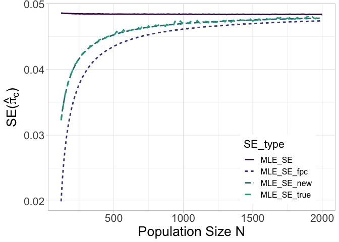

Enhanced Inference for Finite Population Sampling-Based Prevalence
Estimation with Misclassification Errors
================

This page aims to illustrate calculations and simulation studies for the
manuscript “Enhanced Inference for Finite Population Sampling-Based
Prevalence Estimation with Misclassification Errors”.

All functions are available in this github repository and can be loaded
as follows.

``` r
source("FUN_RS_misclassification.R")
```

    ## 
    ## Attaching package: 'dplyr'

    ## The following objects are masked from 'package:stats':
    ## 
    ##     filter, lag

    ## The following objects are masked from 'package:base':
    ## 
    ##     intersect, setdiff, setequal, union

    ## Loading required package: viridisLite

``` r
source("simulation_main.R")
```

## Data Generation

Here is a simple example to generate data for individual level imperfect
test data based on given Sensitivity
() and Specificity
() parameters.
Firstly we need to specify the total population size
()
and the true disease prevalence
(), e.g.,
we set 
and
.
WLOG, we can let the first 100
()
people to be diseased and the remains are health, i.e.,

``` r
N = 1000
p_case = 0.1
N_true = c(rep(1,round(N*p_case)),rep(0,round(N*(1-p_case)))) 
```

Then we could generate the imperfect testing data with the sampling rate
20% and 90%  95%
 by the function
below.

``` r
p.RS = 0.2;Se = 0.9;Sp = 0.95
simu.RS = simu_sym_RS(N,N_true,p.RS,Se,Sp)
test.RS = simu.RS$test
testpos.RS = simu.RS$testpos

n.RS = sum(test.RS) 
n_pos.RS = max(sum(testpos.RS),0.001)
c(n.RS, n_pos.RS)
```

    ## [1] 200  24

Here we generate a imperfect testing data set with size 200 and among
this data set, 24 people are observed positive test results.

## Data Analysis

Next we could calculate the estimate of test positive frequency
(
in paper), the bias-corrected disease prevalence
(
in paper),

``` r
pi_hat = n_pos.RS/n.RS
pi_hat_c = max((pi_hat+Sp-1)/(Se+Sp-1),0)
c(pi_hat, pi_hat_c)
```

    ## [1] 0.12000000 0.08235294

as well as three types of standard errors of

introduced in the paper:

``` r
# V1(pi) in eqn.(1)
V1_pi = pi_hat*(1-pi_hat)/n.RS

# V2(pi) in eqn.(2)
fpc2 = n.RS*(N-n.RS)/(N*(n.RS-1)) 
V2_pi = V1_pi*fpc2

# V3(pi) in eqn.(12)
V_pi_extra = (pi_hat_c*Se*(1-Se) + (1-pi_hat_c)*Sp*(1-Sp))/N
V3_pi = V2_pi+V_pi_extra

sqrt(c(V1_pi, V2_pi, V3_pi))
```

    ## [1] 0.02297825 0.02060395 0.02180648

By inserting eqn.(1), (2), (12) into eqn. (6), we could obtain three
types of standard errors of

as well.

``` r
se.vect = 1/(Se+Sp-1)*sqrt(c(V1_pi, V2_pi, V3_pi))
se.vect
```

    ## [1] 0.02703324 0.02423994 0.02565468

Then we can output the wald-type 95% CIs as well as their width based on
three standard erros as follows.

``` r
# SE w/o fpc
c(pi_hat_c-1.96*se.vect[1],pi_hat_c+1.96*se.vect[1], 2*1.96*se.vect[1])
```

    ## [1] 0.0293678 0.1353381 0.1059703

``` r
# SE w/  fpc
c(pi_hat_c-1.96*se.vect[2],pi_hat_c+1.96*se.vect[2], 2*1.96*se.vect[2])
```

    ## [1] 0.03484266 0.12986322 0.09502055

``` r
# SE new
c(pi_hat_c-1.96*se.vect[3],pi_hat_c+1.96*se.vect[3], 2*1.96*se.vect[3])
```

    ## [1] 0.03206976 0.13263612 0.10056636

In addition to the wald type confidence interval calculated based on the
standard errors estimated above, we introduced a Bayesian credible
interval approach to improve the coverage performance below.

``` r
BC_interval = RS_BC(N,n_pos.RS,n.RS,Se,Sp)
c(BC_interval$BC_lower, BC_interval$BC_upper, BC_interval$BC_width)
```

    ## [1] 0.03806355 0.13805190 0.09998835

## Simulation Studies

To reproduce the simulation results in table 1-3, we can loop for all
testing scenario to calculate all numbers we need.

``` r
N = 500
Se = 0.9
Sp = 0.95
tmp = NULL
for(p_case in c(seq(0.1,0.5,0.2))){
    for(p_stream2 in seq(0.1,0.5,0.2)){
        #print(c(p_case,p_stream2))
        res = find_p_p2(N, p_case,p_stream2,Se,Sp)
        tmp = rbind(tmp,t(c(p_case,p_stream2,res$res.true,res$res.RS[1:5],res$res.BC_width,
                           res$res.BC_pct)))
    }
}

colnames(tmp) = c('p_case','p_stream2','N_true','RS.mean','RS.sd','RS.avgse','RS.width','RS.CIpct',
                  'RS.BC_width','RS.BC_CIpct')
round(tmp[,],3)
```

    ##       p_case p_stream2 N_true RS.mean RS.sd RS.avgse RS.width RS.CIpct
    ##  [1,]    0.1       0.1    0.1   0.098 0.053    0.054    0.213    91.44
    ##  [2,]    0.1       0.3    0.1   0.100 0.030    0.030    0.117    94.56
    ##  [3,]    0.1       0.5    0.1   0.100 0.022    0.022    0.085    94.42
    ##  [4,]    0.3       0.1    0.3   0.300 0.073    0.074    0.289    95.14
    ##  [5,]    0.3       0.3    0.3   0.300 0.040    0.039    0.154    95.22
    ##  [6,]    0.3       0.5    0.3   0.300 0.027    0.027    0.108    94.76
    ##  [7,]    0.5       0.1    0.5   0.502 0.080    0.080    0.314    94.38
    ##  [8,]    0.5       0.3    0.5   0.500 0.042    0.042    0.166    94.82
    ##  [9,]    0.5       0.5    0.5   0.500 0.029    0.030    0.116    95.48
    ##       RS.BC_width RS.BC_CIpct
    ##  [1,]       0.204       95.20
    ##  [2,]       0.116       94.74
    ##  [3,]       0.084       94.64
    ##  [4,]       0.281       95.24
    ##  [5,]       0.152       95.08
    ##  [6,]       0.107       94.56
    ##  [7,]       0.305       94.90
    ##  [8,]       0.164       94.88
    ##  [9,]       0.115       94.94

## Including Figures

Here we prepare the values to plot the figure 1.

``` r
se_rst = NULL
N_tmp = seq(120,2000,10)
Se = 0.9
Sp = 0.95

# observed imperfect testing sample
n.RS=100
p_case = 0.2  

for(N_i in N_tmp){
    tmp = RS_SE_compare_main(N=N_i, p_case=p_case, p.RS=n.RS/N_i, Se=Se, Sp=Sp)  
    se_rst = rbind(se_rst,tmp)
}

plot_data = data.frame(N = N_tmp, MLE_SE_new = se_rst[,4], MLE_SE_fpc = se_rst[,3], MLE_SE = se_rst[,2],
                      MLE_SE_true = se_rst[,1])
plot_data_long = plot_data %>% gather(SE_type, value, -c(N))
```

Finally we could draw the figure through ggplot function.

``` r
My_Theme = theme(
  axis.text.x = element_text(size = 16),
  axis.title.x = element_text(size = 20),  
  axis.text.y = element_text(size = 16),
  axis.title.y = element_text(size = 20),
  legend.position = c(0.8, 0.2),
  legend.title=element_text(size=16),legend.text=element_text(size=12))

p<-ggplot(plot_data_long, aes(x=N, y=value, color = SE_type)) + 
  geom_line(aes(linetype=SE_type),linewidth = 1)+
  scale_color_manual(values = viridis::viridis(6)[1:4])+
  labs(x = "Population Size N", y = expression('SE('*hat(pi)[c]*')')) 

p+theme_light()+My_Theme
```

<!-- -->
